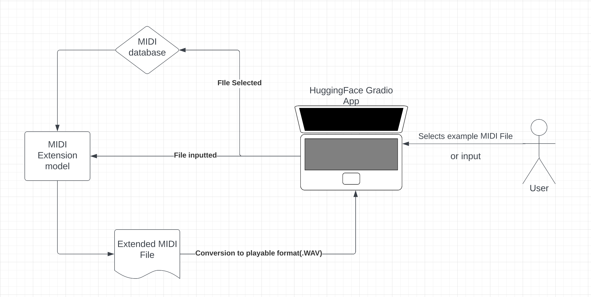

# MIDI Song Extender

## System Architecture

## Model Architecture
Here is the architecture for a transformer_encoder block:

Here is the architecture for our final model:

## Directory Guide
musicautobot folder: this contains the encoder/decoder we use, found from [here](https://towardsdatascience.com/creating-a-pop-music-generator-with-the-transformer-5867511b382a).

transformer-final folder: this is our final trained model.

Comic Relief.mid, wii.mid: these are our test midi files.

file_preprocessing.py: this was used to preprocess the adl-piano-midi dataset by merging all the songs into one folder.

generator.ipynb: this trains and tests the model locally.

model-1.png, model-2.png, image.png: files for model architecture and system architecture visualization

paths.txt: this is a file generated during preprocessing.

preprocessor.ipynb: this takes the midi files in adl-piano-midi folder and turns them into data.npy (an array of encoded songs) and training data.

test.py: this is an exploration and test of the midi encoding system.

transformer_train.py: this is a python file that builds and trains a model like in generator.ipynb.

ui.py: this is a python file that runs the HuggingFace demo.

##### Supplemental Files

[necessary_files](https://drive.google.com/drive/folders/1u26zC-kGG6o9xCCJDkk5Pd8euF4CjiVD?usp=sharing): google drive folder with data files too large to store in the repo. data.npy contains encoded songs, the data folder contains training data pairs. X files contain 100 length integer arrays that serve as input, and y files contain 2 length arrays that are the labels. transformer-final is a copy of the folder in this repo, for Google Colab testing purposes.

[transformer training](https://colab.research.google.com/drive/16mGM6uQ-kkLZ_vXgStZWtfSTnu0coDr-?usp=sharing): Colab notebook for training.

[transformer testing](https://colab.research.google.com/drive/1yJQdfcS7pSXwxYV0oiD0-6jvkowuLVqO?usp=sharing): Colab notebook for testing.

## Training Instructions
Training uses data located in the supplementary [google drive folder](https://drive.google.com/drive/folders/1u26zC-kGG6o9xCCJDkk5Pd8euF4CjiVD?usp=sharing). Training can be done either locally or through Google Colab. You don't need data.npy for training.

##### If using Google Colab:

Create a copy of the Colab notebook [transformer training](https://colab.research.google.com/drive/16mGM6uQ-kkLZ_vXgStZWtfSTnu0coDr-?usp=sharing).

Download the data folder and upload it to a folder in your personal google drive. 

Mount the Google drive and change the path to your folder path. Take note that this folder will also store model checkpoints.

Run the cells. If you are using a previous model, uncomment the keras.model.load_model command and change the path accordingly.

The last cell will load data in batches of 10 and call model.fit on them, then save the model. run the last cell as long as you want. You can also tune hyperparameters in the second to last cell.

Each call of model.fit should take 3 or 4 minutes using a GPU runtime.

##### If training locally:
You will need to download the data folder to a local directory. Change all filepaths and install packages as needed.

Use the generator.ipynb file in this directory. You only need to run the cells in this notebook that correspond with the cells in the Colab notebook.

## Testing Instructions
Testing also uses data located in the [google drive folder](https://drive.google.com/drive/folders/1u26zC-kGG6o9xCCJDkk5Pd8euF4CjiVD?usp=sharing). Testing can also be done either locally or through Google Colab. You don't need the data folder for testing.

##### If using Google Colab:

Create a copy of the Colab notebook [transformer testing](https://colab.research.google.com/drive/1yJQdfcS7pSXwxYV0oiD0-6jvkowuLVqO?usp=sharing).

Download data.npy and upload it to a folder in your personal google drive. Make sure a suitable model is also in the folder.

Mount the Google drive and change the path to your folder path.

Run the cells and load your model, changing the path as necessary.

The midi_predict function takes 100 integers of the beginning of an encoded song as input, writes the input to input.mid, and writes the predicted output to output.mid while also returning the full integer array that got converted to output.mid. 

midi_predict also has some postprocessing features that ensure the predicted song is a valid MIDI encoding. We round a range of note type encodings to the number 8 because 8 encodes to a pause, which is extremely important in how the final product sounds, and previous models weren't able to predict 8 with high accuracy. The provided model should be good enough so that the features are not necessary.

We took encoded song samples from data.npy as an example. The last cell calls midi_predict on the sample. You will see the midi prediction in your drive folder.

##### If testing locally:

You will need to download data.npy to a local directory. Change all filepaths and install packages as needed.

Use the generator.ipynb file in this directory. You only need to run the cells in this notebook that correspond with the cells in the Colab notebook.

Take note, musicautobot runs on a depreciated fastai version (1.0.61), which may cause some issues with package installing.

## Works Cited
##### Electronic Documents
##### API Documentation
[1]K. Team, “Keras documentation: Timeseries classification with a Transformer model,” keras.io. https://keras.io/examples/timeseries/timeseries_transformer_classification/
##### Article from the Internet
[2]A. Shaw, “Creating a Pop Music Generator with the Transformer,” Medium, Aug. 14, 2019. https://towardsdatascience.com/creating-a-pop-music-generator-with-the-transformer-5867511b382a
##### Web Service
[3]L. N. Ferreira, “ADL Piano MIDI,” GitHub, Dec. 01, 2022. https://github.com/lucasnfe/adl-piano-midi (accessed Dec. 08, 2022).