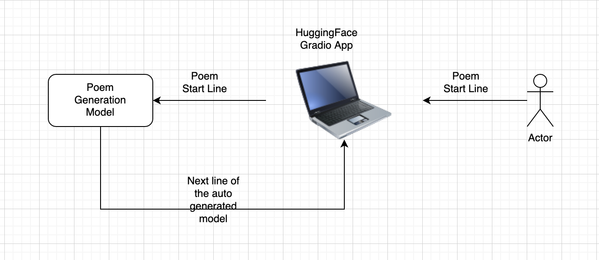
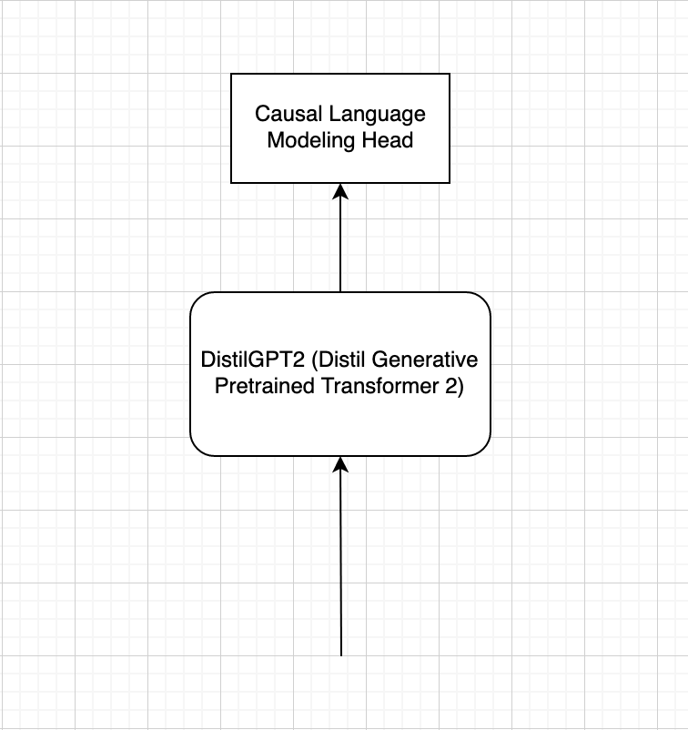

# Poem Generation

## System Architecture

## Model Architecture

## Directory Guide
UI_poem_gen.ipynb: Colab notebook to create a gradio UI just for poem generation application.  

poem generation.ipynb: Colab notebook for end-to-end analysis i.e from processing to model training. 

system_arch_pg.png, model_arch2.png: files for system and model architecture visualization

## Pre-trained Models
Please find pre-trained models here: https://drive.google.com/drive/folders/1-KgkDgnv6qY5G6_Y4lZ2dkNcXEub-V39?usp=sharing

## Training Instructions
##### For Google Colab:

Create a copy of the Colab notebook poem generation.ipynb.

The notebook is self-sufficient. We are installing all the required packages and downloading the required datasets in the notebook.

Mount the Google drive and change the path to your folder to save checkpoints and the model after training.

Run the cells. 

## Testing Instructions
##### For Google Colab:

Create a copy of the Colab notebook poem generation.ipynb.

Mount the Google drive and change the path to your folder path.

Make sure your folder path contains a pre-trained model.

Run model performance and inference cells, by changing the path as necessary.

## Works Cited
##### Research Work
[1] A Gutenberg Poetry Corpus https://github.com/aparrish/gutenberg-poetry-corpus

[2] Hugging Face, "DistilGPT2" [https://huggingface.co/distilroberta-base](https://huggingface.co/distilgpt2)

##### Article from the Internet
[3] Hugging face transformers package https://huggingface.co/docs/transformers/index

[4] Gradio https://gradio.app/
