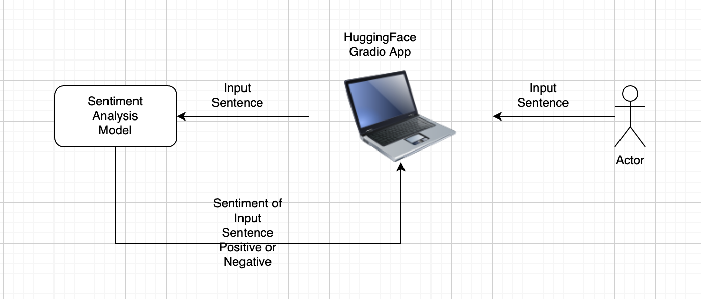
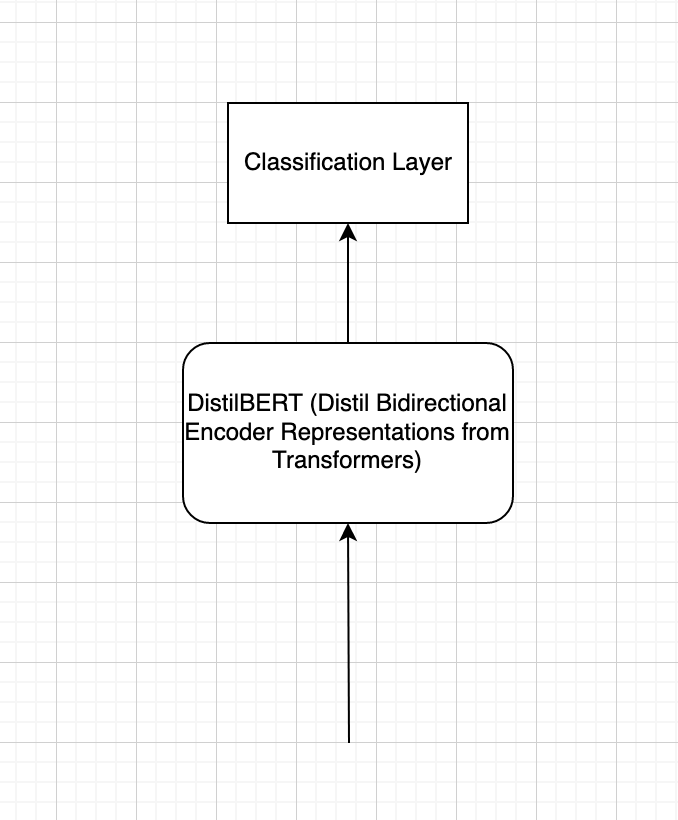

# Sentiment Analysis

## System Architecture

## Model Architecture

## Directory Guide
Dataset_Generation.ipynb: Colab notebook for dataset generation.

GUI_SST2.ipynb: Colab notebook to create a gradio UI just for sentiment analysis application.  

sentiment_analysis.ipynb: Colab notebook to perform end-to-end analysis i.e from processing to training.

model_arch.png, system_arch.png: files for model architecture and system architecture visualization

## Pre-trained Models
Please find pre-trained models here: https://drive.google.com/drive/folders/1gqyg95DL7c4_n7-QuoSmMepy3_pa5LAt?usp=sharing

## Training Instructions
##### For Google Colab:

Create a copy of the Colab notebook sentiment_analysis.ipynb.

The notebook is self sufficient. We are installing all the required packages and downloading required datasets in the notebook.

Mount the Google drive and change the path to your folder to save checkpoints and the model after training.

Run the cells. 

## Testing Instructions
##### For Google Colab:

Create a copy of the Colab notebook sentiment_analysis.ipynb.

Mount the Google drive and change the path to your folder path.

Make sure your folder path contains pre-trained model.

Run model performance and inference cells, by changing the path as necessary.

## Works Cited
##### Research Papers
[1] Sanh, Victor and Debut, Lysandre and Chaumond, Julien and Wolf, Thomas, "DistilBERT, a distilled version of BERT: smaller, faster, cheaper and lighter", https://arxiv.org/abs/1910.01108 

[2] Victor Sanh, Lysandre Debut, Julien Chaumond, Thomas Wolf (Hugging Face), "DistilRoBERTa" https://huggingface.co/distilroberta-base

[3] Richard Socher, Alex Perelygin, Jean Y. Wu, Jason Chuang, Christopher D. Manning, Andrew Y. Ng and Christopher Potts, "Recursive Deep Models for Semantic Compositionality
Over a Sentiment Treebank", https://nlp.stanford.edu/~socherr/EMNLP2013_RNTN.pdf

##### Article from the Internet
[4] Hugging face transformers package https://huggingface.co/docs/transformers/index

[5] Gradio https://gradio.app/
