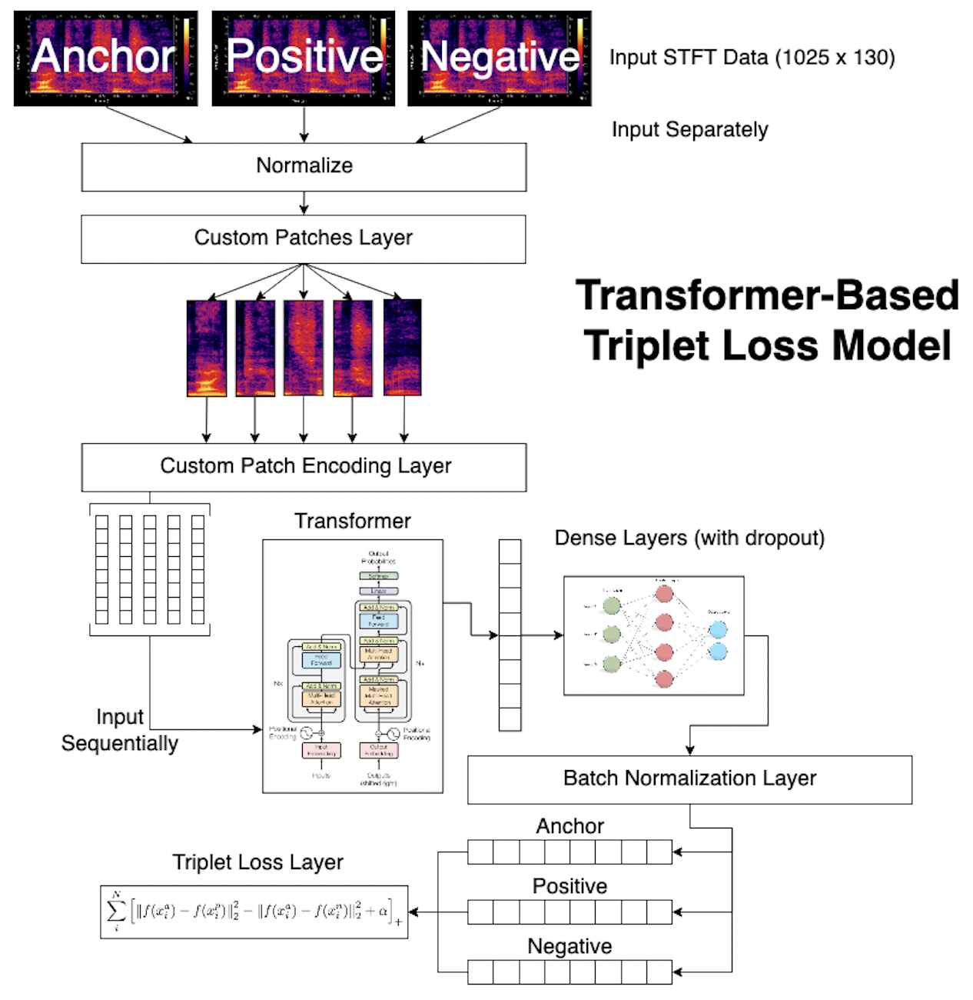

# Augemented Song Recognition Project

Spencer Lutz, Rishi Keshav Pradeep, and Saatvik Vadlapatla

Our project is a song recognition model which has the ability to take in augmented snippets of songs and predict what the actual song is. We built the dataset used to train the model by creating web crawler to pull songs from the iTunes library. The end user interacts with a React app. This UI allows the user to pick from a list of songs and apply augmentations to it such as pitch, speed, and noise. Using the librosa library, a random triplet of STFTs(Short-Term Fourier Transform) are generated for the chosen audio. The STFT data is then split into patches and then fed into the transformer sequentially. This data is passed through a MLP layer which generates an embedding. This embedding is compared to the other songs in the dataset to find the one which is most similar.

## Configuration

Throughout our documentation, for all configuration, you must be in the root folder unless otherwise specified. The root folder is the current directory in which this README is contained in. Since this repo is shared with other FIRE projects, this is the `song-recognition/` directory

## Demo App

To run the demo app, first [setup the environment](./markdown/setup_env.md).

Next, to start the frontend:

```bash
cd frontend
npm start
```

Next, to start the backend:

```bash
cd backend
python3 -m uvicorn main:app --reload
```

**The `frontend` and `backend` must be run simultaneously, so either run them in separate terminals. Alternatively, run them as background tasks, so the processes don't hang the terminal.**

## Video Demo

We've recorded a video demo of our MVP. You can check it out on YouTube [here](TODO:_REPLACE_LINK)!

## System Architecture


## Model Architecture



## Directory Guide

The directory guide can be accessed [here](markdown/directory.md).

## Training the Model

To train the model, use the `model_trainer.sh` bash script.Usage can be found [here](./markdown/scripts.md#training-the-model).

## Testing the Model

To test the model, use the `model_tester.sh` bash script.Usage can be found [here](./markdown/scripts.md#testing-the-model).

## Citations

[1] Florian Schroff, Dmitry Kalenichenko, and James Philbin. 2015. FaceNet: A unified embedding for face recognition and clustering. (June 2015). Retrieved December 7, 2022 from https://arxiv.org/abs/1503.03832 

[2] Silva-Reyes, Andree & Martinez-Licona, Fabiola & Licona, Alma. (2018). Cover Song Recognition Using Machine Learning Techniques. Research in Computing Science. 147. 9-21. 10.13053/rcs-147-4-1. 

[3] Ashish Vaswani et al. 2017. Attention is all you need. (December 2017). Retrieved December 7, 2022 from https://doi.org/10.48550/arXiv.1706.03762 

